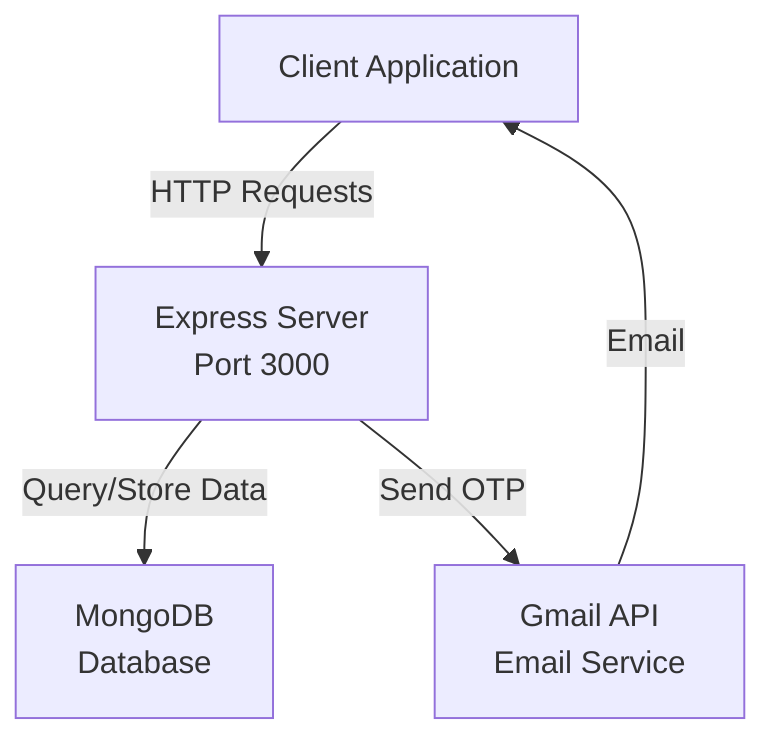
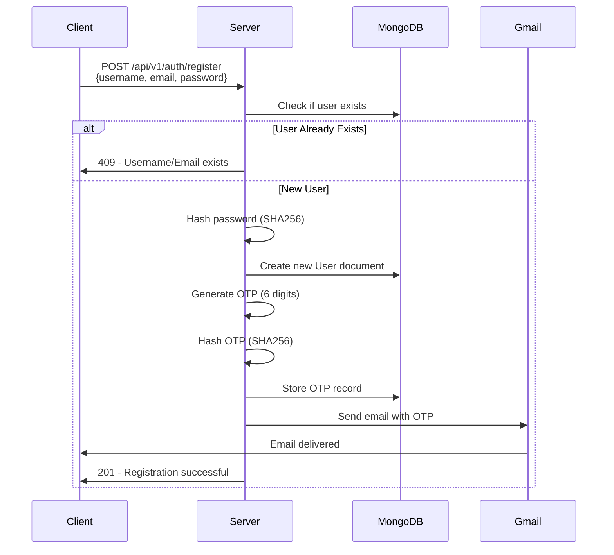
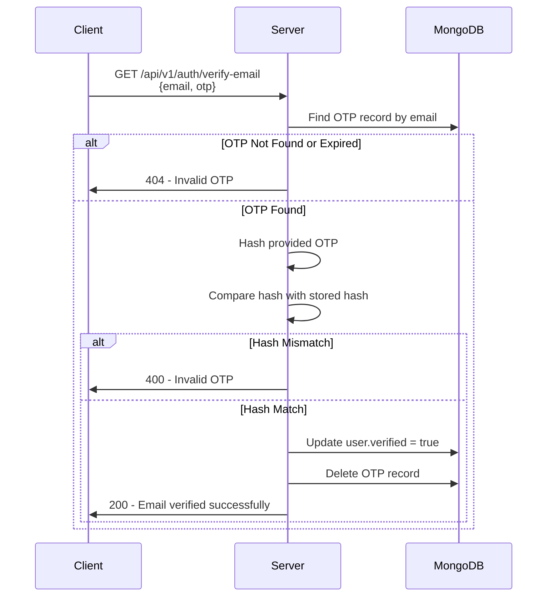
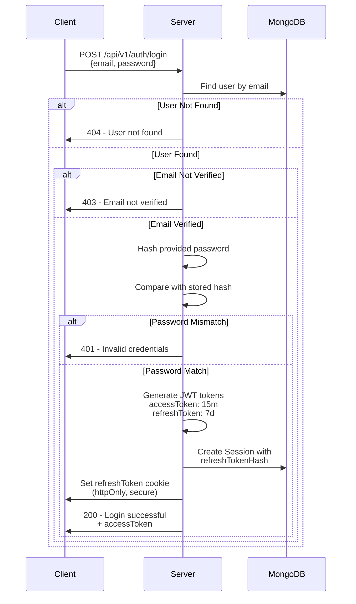
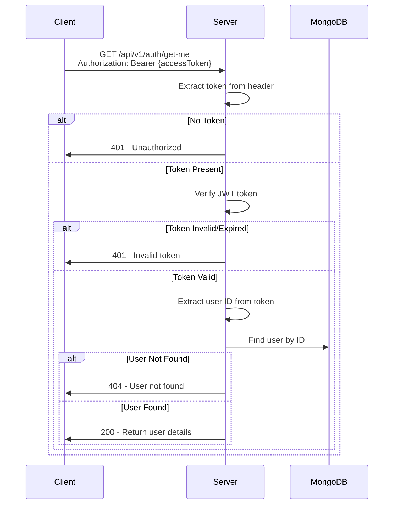
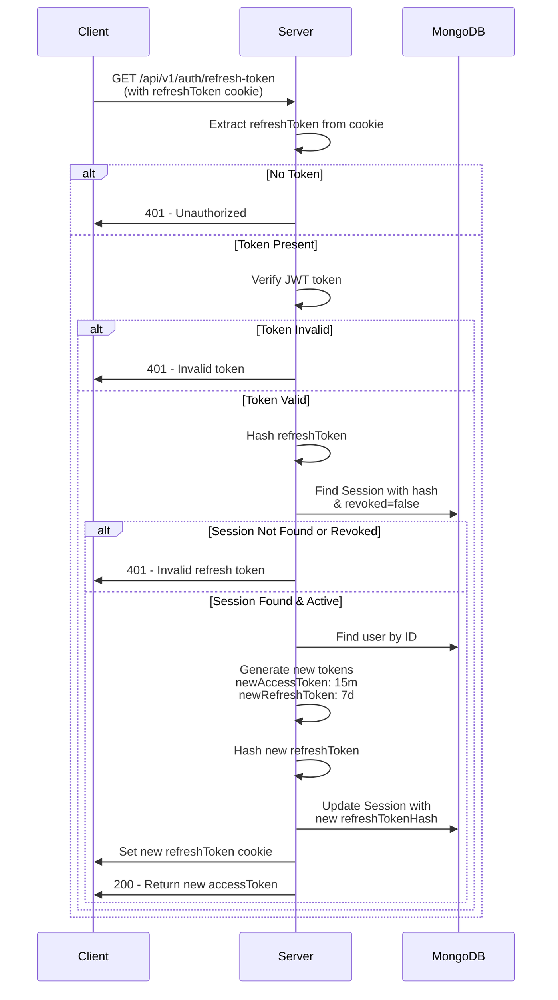
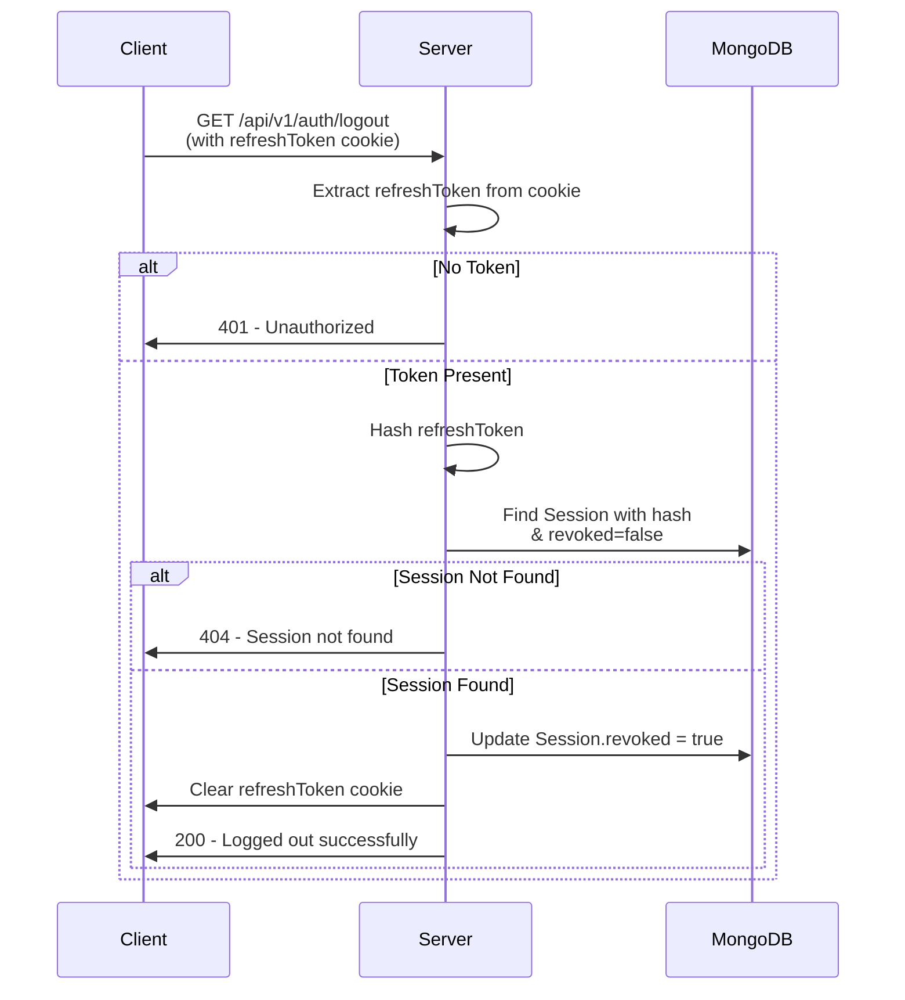
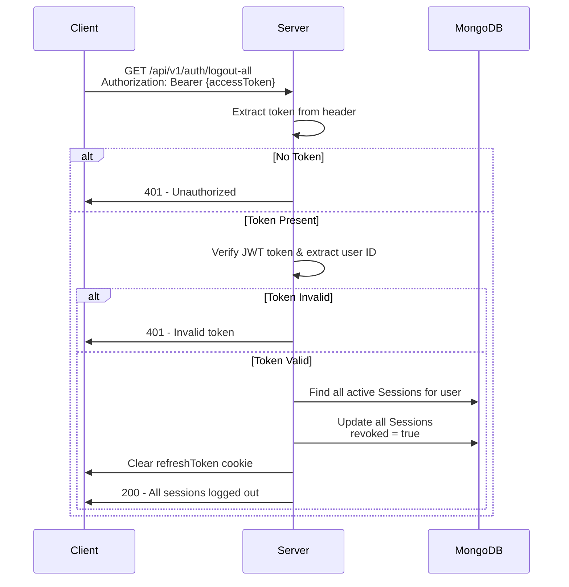

# Authentication App - Complete Flow

This document outlines the complete flow of the authentication application using Mermaid diagrams.

## 1. System Architecture



## 2. User Registration Flow



## 3. Email Verification Flow



## 4. User Login Flow



## 5. Get User Profile Flow



## 6. Token Refresh Flow



## 7. Logout Flow (Single Session)



## 8. Logout All Sessions Flow



## 9. Data Models

### User Model

```
{
  _id: ObjectId,
  username: String (unique, required),
  email: String (unique, required),
  password: String (SHA256 hashed, required),
  verified: Boolean (default: false),
  createdAt: Timestamp,
  updatedAt: Timestamp
}
```

### OTP Model

```
{
  _id: ObjectId,
  email: String (required),
  user: ObjectId (references User),
  otpHash: String (SHA256 hashed, required),
  createdAt: Timestamp,
  updatedAt: Timestamp
}
```

### Session Model

```
{
  _id: ObjectId,
  user: ObjectId (references User),
  refreshTokenHash: String (SHA256 hashed),
  revoked: Boolean (default: false),
  createdAt: Timestamp,
  updatedAt: Timestamp
}
```

## 10. API Endpoints Summary

| Method | Endpoint                     | Description                    | Auth   |
| ------ | ---------------------------- | ------------------------------ | ------ |
| POST   | `/api/v1/auth/register`      | Register new user & send OTP   | ❌     |
| GET    | `/api/v1/auth/verify-email`  | Verify email with OTP          | ❌     |
| POST   | `/api/v1/auth/login`         | Authenticate user & get tokens | ❌     |
| GET    | `/api/v1/auth/get-me`        | Fetch current user profile     | ✅     |
| GET    | `/api/v1/auth/refresh-token` | Refresh access token           | Cookie |
| GET    | `/api/v1/auth/logout`        | Logout current session         | Cookie |
| GET    | `/api/v1/auth/logout-all`    | Logout all sessions            | ✅     |

## 11. Security Features

- ✅ **Password Hashing**: SHA256 algorithm
- ✅ **OTP Hashing**: 6-digit OTP hashed before storage
- ✅ **JWT Tokens**: 15-minute access token, 7-day refresh token
- ✅ **Refresh Token Hash**: Tokens hashed in database
- ✅ **HttpOnly Cookies**: Refresh token stored as httpOnly cookie
- ✅ **HTTPS Secure Cookies**: Secure flag enabled
- ✅ **CORS Protection**: SameSite strict cookie policy
- ✅ **Session Management**: Active session tracking with revocation
- ✅ **Email Verification**: OTP-based email verification

## 12. Tech Stack

- **Framework**: Express.js
- **Database**: MongoDB
- **Authentication**: JWT + Session Management
- **Email**: Gmail API
- **Logging**: Morgan
- **Hashing**: Node.js crypto module
